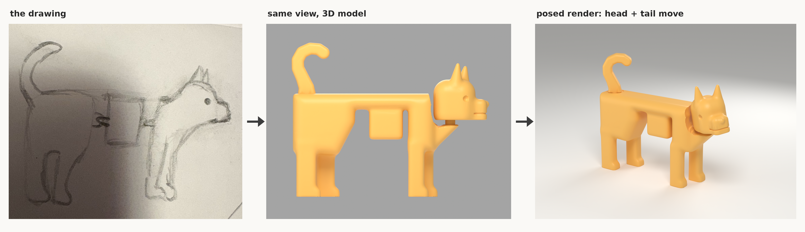

# Articulated dog — a child's drawing as a printable toy



A 3-part, glue-free, FDM-printable toy built directly from a child's pencil drawing of a dog
(long level back, boxy belly, four chunky legs, small head with two pointed ears, big tail hooking upward).
The side silhouette follows the drawing; the drawing's quirks are kept on purpose (the belly box, the
side-by-side legs and ears that a child draws to show "both", the blunt muzzle).

It has **exactly two joints**: the **head** (ball joint) and the **tail** (swivel). Everything else is one solid piece.

* Source image: https://drive.google.com/file/d/13HVwXR2jKd8h_SItTTXizeP983Ik6S_V/view?usp=drivesdk  (copy included unmodified as `source_drawing.jpg`)
* Everything is generated by the scripts in `scripts/` — change `scripts/params.py` and re-run to modify.

## Final dimensions (assembled, neutral pose)

| | mm |
|---|---|
| Length (tail to nose) | **141.23** |
| Width | **32.9** |
| Height (floor to tail top) | **110.47** |

## Parts

| File | Qty | Print size (mm) | Volume | Notes |
|---|---|---|---|---|
| `stl/body.stl` | 1 | 118.49 x 32.9 x 74.0 | 115.58 cm³ | torso, 4 legs, ball stud for the head, bore for the tail |
| `stl/head.stl` | 1 | 39.84 x 26.0 x 40.7 | 18.59 cm³ | socket in the flat underside |
| `stl/tail.stl` | 1 | 27.26 x 58.22 x 9.8 | 5.46 cm³ | split snap-pin at the root |

The STLs in `stl/` are already in their print orientation. `dog_print.3mf` holds all three on one plate.
`dog_assembled.stl` / `dog_preview.glb` / `dog_complete.blend` show the assembled toy (in the .blend, rotate the
two `JOINT_*` empties to pose it). No separate joint parts and no hardware are needed.

## Joint A — head: slotted ball-and-socket (snap-on)

* A Ø12.0 mm ball on a Ø7.4 mm stalk stands vertically on the neck of the body.
  A 2.0 mm slot splits ball and stalk into two halves that flex towards each other; a 1.2 mm wide
  relief moat around the stalk makes the flexing length 12.6 mm. The ball has two flats
  (7.6 mm across) so the squeezed halves can actually pass the round throat.
* The head has a rigid Ø12.2 mm spherical socket reached through a tapered tunnel from its flat underside
  (throat Ø11.773 mm). The socket roof is a 45° cone so it prints without support.
* Fit: radial clearance 0.1 mm sphere-to-sphere, but each ball half is modelled 0.25 mm
  outward, giving a deliberate **0.15 mm elastic preload per side**. That preload — not a tight
  rigid fit — is what holds the head where you put it and absorbs printer tolerance.
* Movement (collision-checked): **turn left/right ±90°** (hard stop at about ±102°),
  **nod ±15°** (stop ≈ 19°), **sideways tilt ±12°** (stop ≈ 19°).

## Joint B — tail: swivel on a split snap-pin

* The tail root carries a Ø10.0 mm pin, 21.5 mm long, split by a 3.6 mm slot into two
  3.2 mm arms with a barb (Ø11.4 mm) at the tip.
* The body has a vertical Ø10.4 mm bore (22.6 mm deep) with an undercut (Ø12.2 mm) and a
  45° ledge. The barbs snap under the ledge (0.5 mm engagement per side).
* Fit: radial clearance 0.2 mm; a friction band on the arms is 0.1 mm oversize on radius so the
  arms press lightly on the bore and the tail stays where it is put. Axial play ≈ 0.45 mm.
* Movement: **full 360° rotation** about the vertical axis — the hook can point forward (as drawn), sideways or back.
* The root is the same 9.8 mm thick as the tail, printed flat so the layers run along the snap arms.

## Printing

| Setting | Recommendation |
|---|---|
| Filament | PLA (PETG also fine and a little more forgiving on the snaps) |
| Nozzle / layer | 0.4 mm / 0.20 mm |
| Perimeters | 4 (3 minimum) — the ball stalk and the pin arms are then solid perimeters |
| Infill | 15 % |
| Top / bottom | 5 / 4 layers |

| Part | Orientation | Supports |
|---|---|---|
| body | standing on its four feet (as in the STL) | **yes — "supports on build plate only"**, under belly box, torso and between the legs. None are needed inside the tail bore or around the ball. |
| head | flat underside on the bed (as in the STL) | **none** — do not enable supports, they would fill the socket |
| tail | lying on its flat side (as in the STL) | **none** |

Slicer estimates (PrusaSlicer, settings above): body 7h 11m 23s / 84.55 g,
head 54m 52s / 11.02 g, tail 21m 53s / 4.51 g — about 100 g in total.
If you open `dog_print.3mf`, switch supports on for the body only.

## Assembly (no glue, no tools)

1. Remove the supports from under the body. Check the slot in the ball and the moat around the stalk are clear.
2. **Tail:** hold the tail above the hole in the rump and push straight down until it clicks
   (the arms need to squeeze 0.6 mm each; the slot allows 1.8 mm).
3. **Head:** set the hole in the underside of the head over the ball and push straight down until it snaps
   (each ball half squeezes 0.36 mm; the slot allows 1.0 mm). Push on the top of the head between the ears, not on the ears.
4. Both joints can be pulled off again with a firm straight pull.

## Optional tolerance test (`test/joint_tolerance_test.stl`)

Four small pieces, already in print orientation, no supports (2h 50m 31s, 23.66 g):

* a block with three head sockets — radial clearance **0.00 / 0.10 / 0.20 mm**, marked with 1 / 2 / 3 notches
  (2 notches = the production head),
* the production ball stud on a small base,
* a block with the production tail bore, and the production tail pin on a handle.

The ball should snap into the 2-notch socket with a firm push and then turn smoothly with noticeable friction.
If only the 3-notch socket feels right, set `SOCKET_CLEAR = 0.20` in `scripts/params.py`; if the 1-notch one does,
set `0.00`; then re-run `generate.py`. For the tail, adjust `BORE_CLEAR` (looser/tighter turning) or `BAND_INTERF` (friction).

## Reproducing

```
pip install numpy scipy scikit-image trimesh manifold3d shapely rtree pillow networkx lxml
cd scripts
python3 generate.py            # shells (SDF) + joints (CSG) -> stl/, dog_assembled.stl
python3 make_test.py           # tolerance test piece
python3 make_3mf.py            # dog_print.3mf
python3 validate.py            # mesh / collision / assembly / stability checks -> build/validation.json
python3 slice_all.py           # PrusaSlicer CLI on every part -> build/slicing.json
blender -b -P render_blender.py   # renders, dog_complete.blend, dog_preview.glb
python3 silhouette_compare.py; python3 presentation.py; python3 build_docs.py
```
See `validation_report.md` for all measured values and known compromises.
