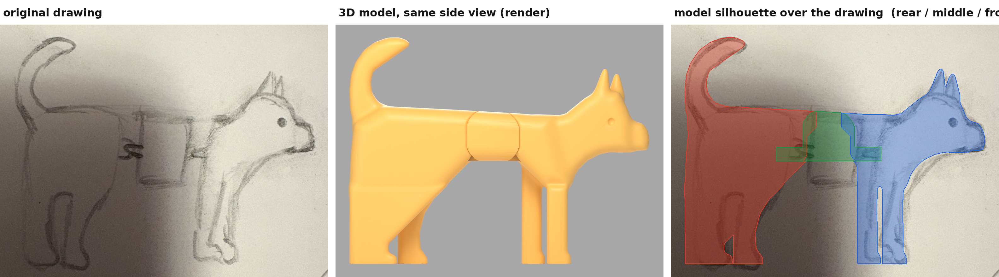
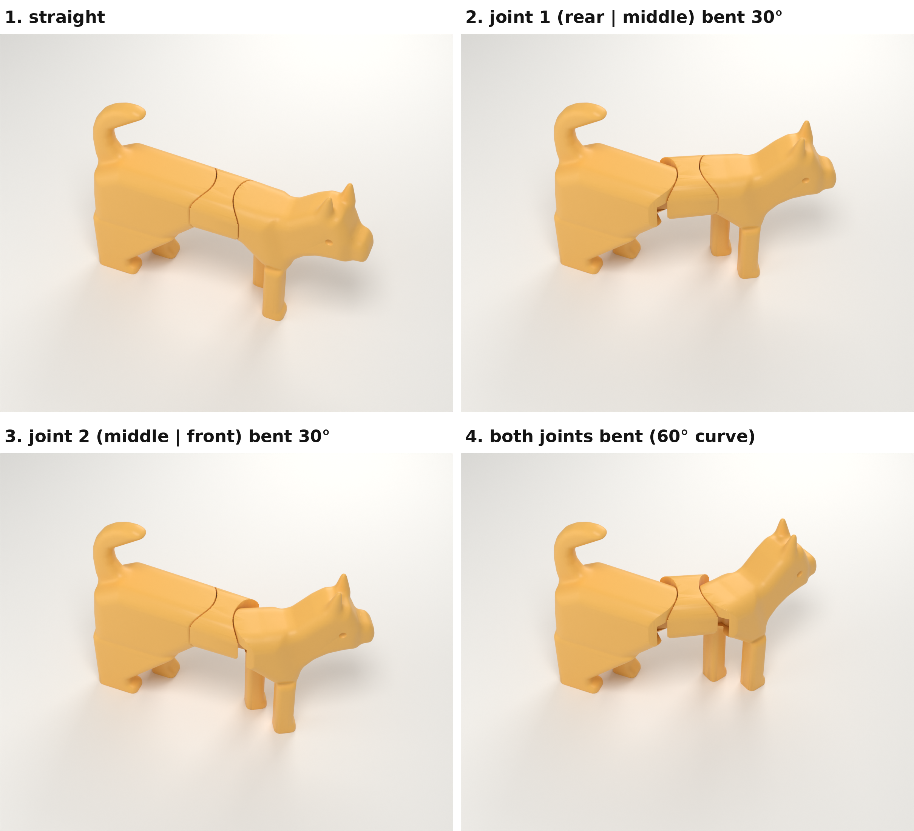
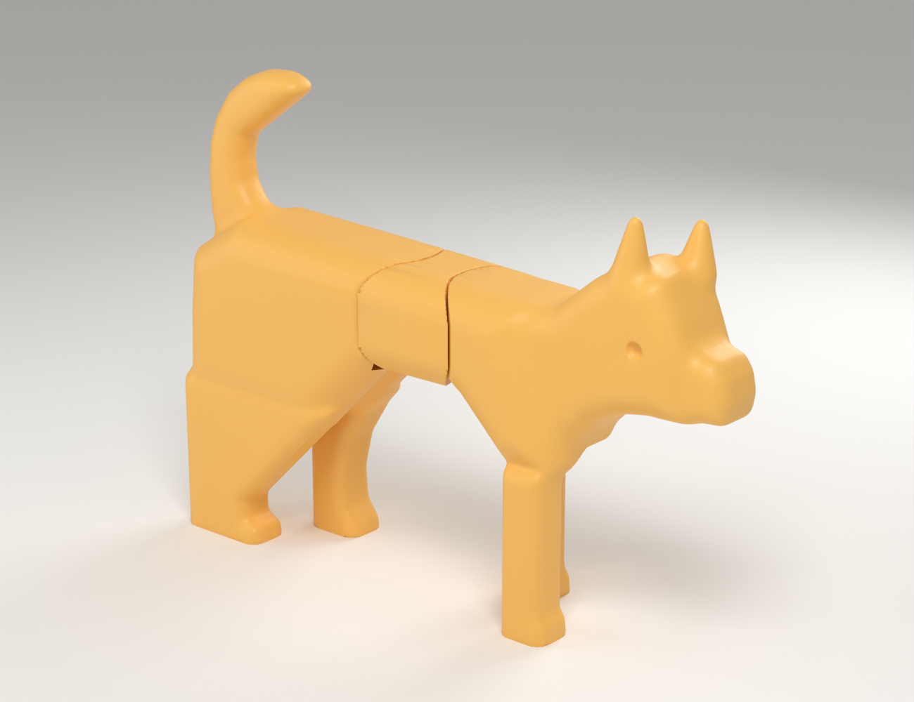

# Articulated drawing-dog (final version)



A child's pencil drawing of a dog, given thickness and turned into a small FDM-printable toy.
The side silhouette is traced from the drawing; the body bends at **two joints in the torso**. Head, neck and tail are fixed.

```
[ REAR: tail + rump + rear legs ] <joint 1> [ MIDDLE: short torso slice ] <joint 2> [ FRONT: chest + front legs + neck + head ]
```



| | |
|---|---|
| Size (straight) | **150.75 x 30.11 x 113.38 mm** (length x width x height) |
| Printed pieces | **3** — `stl/rear.stl`, `stl/middle.stl`, `stl/front.stl` (no pins, no glue, no hardware) |
| Joints | exactly 2, both vertical-axis snap pivots hidden inside the torso |
| Movement | joint 1: -32.0° … +32.0°, joint 2: -32.0° … +32.0° left/right (hard stops); up to 60° combined curve |
| Middle piece | 28.44 mm long at the flanks, same cross-section as the torso |
| Source drawing | https://drive.google.com/file/d/13HVwXR2jKd8h_SItTTXizeP983Ik6S_V/view?usp=drivesdk (copy: `source_drawing.jpg`) |

More views: [side](renders/side.png) · [opposite side](renders/opposite_side.png) · [front](renders/front.png) · [rear](renders/rear.png) · [top](renders/top.png) · [perspective](renders/perspective.png)



## How the joints work

Each joint is a **vertical pivot post with a snap-on C-clip**:

* The rear and the front section each contain a Ø11.0 mm vertical **post** standing in a 7.55 mm high slot at belly level.
* The middle piece has a flat **tongue** at each end (7.0 mm thick, 6.0 mm neck) ending in a **C-shaped clip** that wraps 216° of the post.
  It is printed flat, so the clip arms flex within the layers — the strong direction.
* Push the tongue into the slot and the clip snaps over the post. It then turns only about the vertical axis (yaw);
  slot floor and ceiling keep it from tilting.
* The seam between sections is a cylinder concentric with the pivot (radius 18.0 mm), so the gap stays a constant
  0.5 mm line at every angle and the three pieces read as one dog when straight.

Clearances (all parameters in `source/params.py`):

| Fit | Value |
|---|---|
| Seam gap between sections | **0.5 mm** |
| Neck to yaw-stop faces | **0.4 mm** |
| Under / over the tongue | 0.2 / 0.35 mm (measured play 0.2 / 0.35 mm) |
| Room around the clip (for snapping) | 0.9 mm radial, 0.7 mm per side in the insertion corridor |
| Clip on post | not a clearance fit: the clip bore is Ø10.8 on a Ø11.0 post, i.e. **0.1 mm radial elastic preload**. The spring grip is what holds a pose; it tolerates printer variation because the arms flex. |

If your printer makes the joints too stiff or too loose, change `CLIP_PRELOAD` (0.00 = looser, 0.20 = tighter) and re-run `generate.py`; only `middle.stl` changes (38 min print).

## Printing (PLA, 0.4 mm nozzle, 0.20 mm layers, 3 perimeters, 15 % infill)

| Part | Orientation (as in the STL) | Supports | Brim | Time | Filament |
|---|---|---|---|---|---|
| `rear.stl` | standing on its two feet | **none** | 5 mm recommended | 3h 15m 12s | 37.70 g |
| `middle.stl` | lying on its belly, tongues on the bed | **none** | no | 38m 1s | 7.50 g |
| `front.stl` | standing on its two feet | **build plate only**, overhang threshold 20° — a single column under chin and throat (6.75 g) | 5 mm recommended | 3h 24m 27s | 35.20 g |

Total about **7 h 17 min** and **80 g** (PrusaSlicer estimate). `dog_print.3mf` has all three parts on one plate.

Important: use *build-plate-only* supports. "Supports everywhere" would fill the joint slots. With build-plate-only supports nothing can get
into the slots (checked in the g-code: 0 support moves inside the joint).
All undersides of the rear and front sections are shaped at 45° or steeper so they print without support.

## Assembly

1. Remove brim and the support column under the chin.
2. Hold the middle piece with its flat belly down. Push one tongue straight into the slot at the cut face of the rear section until it clicks onto the post.
3. Push the front section onto the other tongue the same way.
4. To take it apart, pull the sections straight apart.

The clip arms open 0.3 mm each while snapping (room available: 0.7 mm).

## Files

```
dog_complete.blend   posable scene (rotate the two JOINT_* empties about Z)
dog_preview.glb      assembled preview
dog_print.3mf        all parts on one plate
stl/                 rear.stl, middle.stl, front.stl (print orientation)
renders/             source_vs_model.png, articulation_demo.png, side/opposite_side/front/rear/top/perspective
source/              params.py, generate.py, validate.py, slice_all.py, render_blender.py, compare.py, demo.py, make_3mf.py, build_docs.py
validation_report.md measured results
```
Rebuild: `cd source && python3 generate.py && python3 make_3mf.py && python3 validate.py && python3 slice_all.py && blender -b -P render_blender.py && python3 compare.py && python3 demo.py && python3 build_docs.py`

Version 1 (movable head and tail) is superseded; it remains available under release v1.0.
